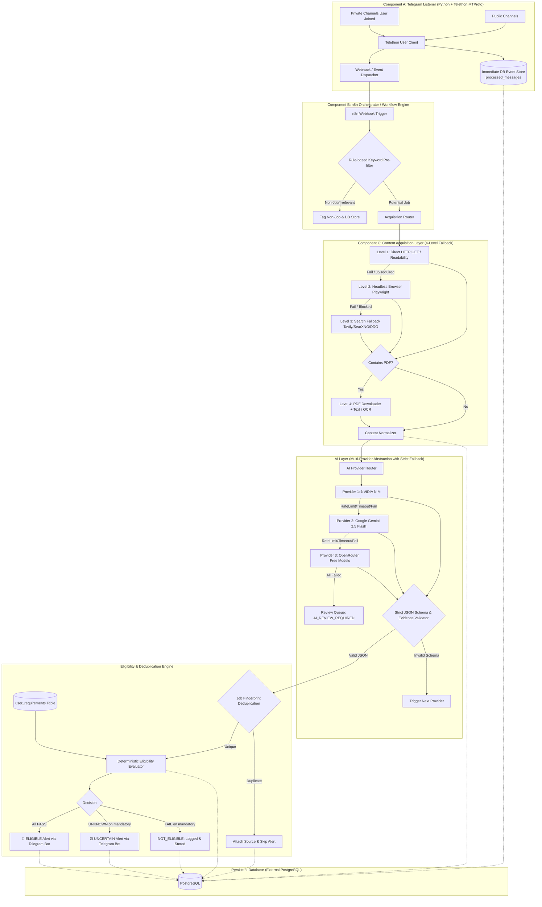

# ARCHITECTURE LOCK & SYSTEM SPECIFICATION

> **LOCKED DOCUMENTATION**  
> **Status:** AUTHORITATIVE & LOCKED  
> **Rule:** Under no circumstances should the architecture defined herein be simplified, replaced, or degraded without explicit, formal authorization.

---

## 1. System Overview & Core Architecture

The **Personal Government Job Notification Intelligence & Eligibility Alert System** is an automated, multi-tiered intelligence pipeline designed to ingest, normalize, analyze, filter, and alert on recruitment notifications from public and private Telegram channels.

---

## 2. Components & Separation of Concerns

### Component A: Telegram Listener
- **Technology:** Python 3.11+ using `Telethon` (MTProto user-client protocol).
- **Security:** Authenticates via user session string (`TELEGRAM_SESSION`) stored solely in secure environment variables. **No file-based sessions or plaintext tokens committed to git.**
- **Private Channel Access:** Reads private channels where the user account has access (cannot be done via Telegram Bot API).
- **Reliability:** Immediately persists raw inbound messages and metadata to PostgreSQL `processed_messages` before initiating any downstream processing.
- **Resilience:** Automatic reconnection with exponential backoff on network disruptions or Telegram disconnects.

### Component B: n8n Workflow Orchestrator
- **Technology:** n8n Workflow Automation Layer (via webhook endpoints / workflow runner).
- **Responsibilities:**
  - Ingestion triggers from Component A.
  - Step-by-step pipeline routing, conditional branches, and failure interception.
  - Calling content extraction endpoints.
  - Driving AI fallback sequences.
  - Invoking the deterministic eligibility engine.
  - Maintaining execution logs and triggering retries.

### Component C: Content Acquisition Layer (4-Tier Fallback)
1. **Level 1 — Direct HTTP Extraction:** `httpx` + `BeautifulSoup4` + Readability algorithms to extract core article text, canonical URLs, and PDF links cleanly.
2. **Level 2 — Headless Browser Extraction:** Playwright / Chromium for dynamic SPA or JavaScript-rendered portals. Captures rendered DOM, resolved links, and PDF targets.
3. **Level 3 — Search Fallback:** When source URLs are dead, truncated, or masked (common in Telegram forwards), queries search APIs (e.g. Tavily, SearXNG, DuckDuckGo) using organization + post + notification number to pinpoint official portals.
4. **Level 4 — PDF & OCR Extraction:** Downloads official notification PDFs. Extracts native PDF text via `pypdf` / `pdfplumber`. If text density is near zero (scanned PDF), seamlessly routes to Tesseract OCR.

### Component D: Multi-Provider AI Extraction Layer
- **Provider-independent interface:** `AIProvider` base class with concrete adapters:
  1. `NvidiaNIMProvider` (Primary)
  2. `GeminiProvider` (Secondary fallback: `gemini-2.5-flash`)
  3. `OpenRouterProvider` (Tertiary fallback)
- **Strict Anti-Hallucination:**
  - AI extraction outputs strict JSON strictly conforming to the `JobExtractionSchema`.
  - Missing or unstated fields MUST evaluate to `null`. Guessing is strictly prohibited.
  - Every extracted key parameter (qualifications, age limits, pay scale, deadlines) must include an `evidence` record with exact excerpt and source page/URL.
- **Failover:** Automatic routing to next provider on timeout, rate limit (HTTP 429), malformed JSON, or schema validation failure. If all fail, flags as `AI_REVIEW_REQUIRED`.

### Component E: Deterministic Eligibility Engine
- **Separation of Concerns:** AI extracts *facts*; deterministic business rules evaluate *eligibility*.
- **Evaluation Rules:**
  - Hard checks for: Age limits, educational degree, branches, experience requirements, category reservations, excluded job types.
  - Decision Logic:
    - If ANY mandatory requirement == `FAIL` $\rightarrow$ **`NOT_ELIGIBLE`**
    - Else if ANY mandatory requirement == `UNKNOWN` $\rightarrow$ **`UNCERTAIN`**
    - Else (all mandatory PASS) $\rightarrow$ **`ELIGIBLE`**
  - **Golden Rule:** `UNKNOWN` is NEVER converted to `PASS`.

### Component F: Dynamic User Profile Management
- Direct fulfillment of the user requirement: *"is hould able to edit the requirements of me"*.
- **Persistent Storage:** Stored in the `user_requirements` PostgreSQL table.
- **Interfaces:**
  1. **REST API:** `GET /api/requirements` and `PUT /api/requirements` with validation.
  2. **Management Dashboard UI:** Interactive, responsive Web UI to view, edit, and save requirements (qualifications, branches, age, fresher status, location preferences) with real-time JSON validation.
  3. **Telegram Bot Commands:** Interactive `/profile` and `/set_*` commands to check or modify rules on the fly.

### Component G: Deduplication & Fingerprinting
- Generates composite cryptographic fingerprint from normalized `(organization, post_name, notification_number, application_deadline, official_url)`.
- Multiple alerts across 10+ Telegram channels referring to the same notification result in **exactly one alert**, referencing all discovered sources.

### Component H: Alerting & Outgoing Bot
- Telegram Bot API client for sending high-priority alerts:
  - 🚨 **ELIGIBLE JOB**: Complete dossier with breakdown of qualifications, age, experience, salary, deadlines, official PDF/apply links, and explicit "Why you are eligible" justification.
  - 🟡 **POSSIBLE MATCH (UNCERTAIN)**: Highlighted breakdown specifying precisely which criteria passed and which criteria are ambiguous or require manual review.

---

## 3. Database Schema (Logical & Physical Specifications)

The persistent database (PostgreSQL) contains the 7 mandatory logical tables:

1. **`channels`**: Monitored Telegram channels (channel ID, username/title, type: public/private, enabled flag).
2. **`processed_messages`**: Raw Telegram events persisted immediately upon receipt (channel ID, message ID, text, media, raw payload, processing status, correlation ID).
3. **`jobs`**: Normalized job opportunities (fingerprint, organization, post name, notification number, structured JSON, eligibility status, AI provider used).
4. **`sources`**: URLs and references linked to jobs (job ID, URL, source type [official/secondary/telegram], verification status).
5. **`alerts`**: Outgoing alert audit trail (job ID, chat ID, alert type [ELIGIBLE/UNCERTAIN], message ID, sent timestamp).
6. **`failures`**: Failure recovery log (processing ID, component, error details, retry count, next retry timestamp, status).
7. **`user_requirements`**: User eligibility configuration (versioned JSON document containing educational levels, accepted branches, age limit, fresher rules, etc.).

---

## 4. Prohibited Architectural Changes

The following changes are strictly prohibited:
- ❌ Replacing n8n with another automation tool.
- ❌ Replacing Python / Telethon with a standard Telegram Bot for inbound listening (bots cannot read private channels).
- ❌ Removing the multi-provider AI abstraction or locking to a single AI vendor.
- ❌ Storing state solely on local disk or in memory (Render is ephemeral).
- ❌ Auto-promoting `UNKNOWN` eligibility results to `PASS`.
- ❌ Inventing unverified model names, endpoints, or hallucinating job requirements.
